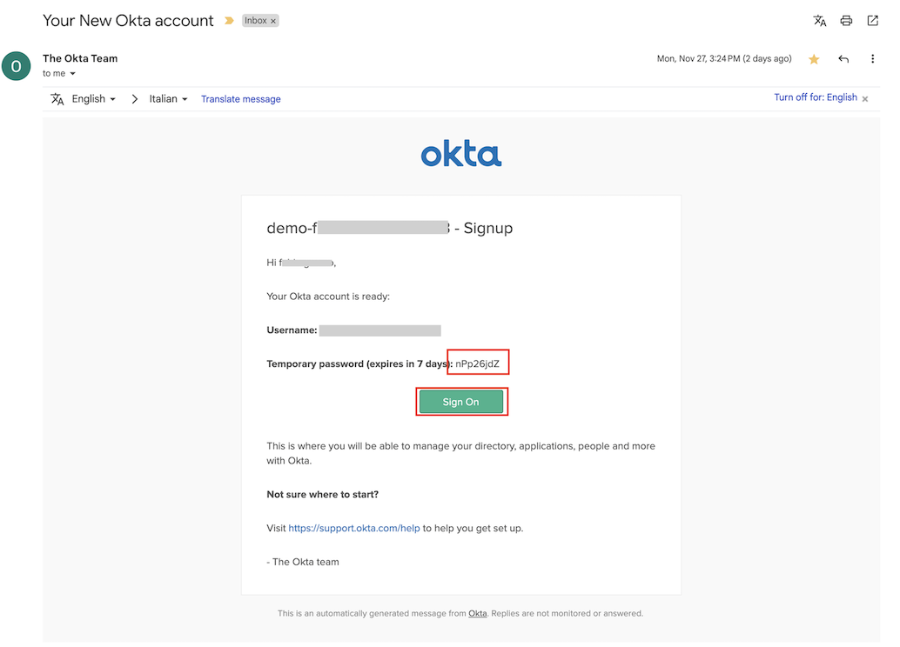
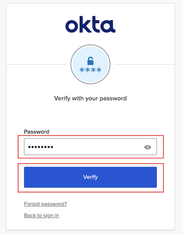
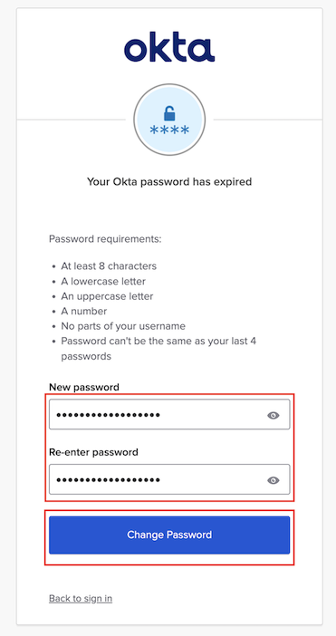
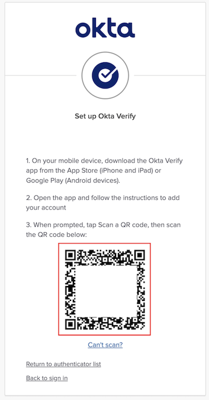
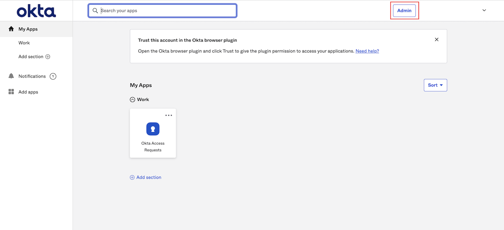
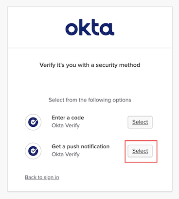

# Learning Objectives
Today we are going to learn the following topics: 

- How to integrate Okta with Active Directory
- How to integrate Office 365 with Okta
- How to automatically on and offboard employees
- How to customize complex identity requirements with Okta Workflows
- How to ensure the right people have the right access to the right resources with the least amount of friction

---

# Workshop structure

This workshop is broken into the sections listed below. 

- **Platform Review and Preparation**
- **Identity Sources**
    - Integrate Active Directory
- **Integrationg Applications for secure Single-Sign-On and Lifecycle management**
    - Office 365
- **Security Policies**
    - Okta FastPass
    - Device Assurance
    - Okta ThreatInsight
- **Okta Workflows**
    - Learn how to automate identity processes
    - Extend the onboarding experience
- **Okta Identity Governance (OIG)**
    - Prepare your Environment
    - Access Requests
    - Access Certifications

---

# Prerequisites

**To ensure that the lab works properly and to access to Okta tenant, you will need to install Okta Verify on one of your mobile device.**

|          | **Okta Verify** is available for free at |
|-|-|
|    | **Google Store** : https://play.google.com/store/apps/details?id=com.okta.android.auth&hl=en&gl=US |
|      | **Apple Store** : https://apps.apple.com/fr/app/okta-verify/id490179405 |

---

## Activate your Okta tenant

1. Open the welcome email (*Your New Okta account*). Take note of the *temporary password* and click on **Sign On**
    

2. Enter the *temporary password* and click **Verify**
    

3. Digit a new password and click **Change Password**

    > **Take note of this password as you will use it many times during this workshop!**

    

4. Click on **Set up** for start the enrollment of *MFA* with *Okta Verify*
 
    

5. Open **Okta Verify** on your mobile phone.
    1. Tap **Add Account** (or the " **+** " on the top right corner )
    2. Choose the type of account to add. Tap **Organization**.
        > Note: 
        > - *Organization*: Add a multifactor authentication (MFA) account for your work, school, or business that uses Okta as an authentication provider.
        > - *Other*: Use Okta Verify to generate one-time passwords for your personal account such as a bank or brokerage account.
        > 
        > You can use Okta Verify for generate OTP Password, with support for TOTP, Google Authenticator, etc.
    3. Choose **Skip** at the *Add Account from Another Device* prompt
    4. Tap **Yes, Ready to Scan**, and point your camera at the QR code displayed in the browser
        > If you don’t know how to obtain the QR code, tap Where do I get my QR code?
        
        > If you can’t scan the QR code, tap No, Sign In Instead. Follow the instructions in Set up Okta Verify on your iOS device by using your sign-in URL.
    
        

    5. If prompted, **allow push notifications** on your device so that you can approve future sign-in notifications without opening the Okta Verify app.

    6. If prompted, enable Face ID or Touch ID. Tap **Enable**.
    
    7. Tap **Done** to complete the account enrollment.

6. You should see the *Okta Dashboard*. Click on **Admin** in the top-right corner

    

7. Click **Select** on the right of **Get a push notification**.
    
    Complete the MFA challenge on your phone.

    

    > Note: since the access to the Admin Dashboard is an high privilege operation, the default policy require an MFA authentication. Even if you can change this behaviour, we warmly suggest to use the highest level of security policy for the Admin access.

8. You will land on the **Admin Dashboard**

    

---

## Register for a Microsoft account

In this section you will register for a Microsoft account. If you already have an existing account you can skip this section but it is probably better to create a dedicated account for use with your Okta demo environment.

In this guide, we will use a new *outlook.com* email address. You might prefer to sign up with your Okta email address or even use an existing personal Microsoft account.

> Note: At the end of this section you will have to wait up to one hour for your name to propagate to the developer site. You can continue with the rest of the lab (Active Directory) in the meantime.

1. Open a browser and navigate to: https://developer.microsoft.com/en-us/microsoft-365/dev-program
    
    You’ll see the following page:

    

2. Click **Join now**.
    
    The login page is displayed:

    

3. Click **Create one**

    

4. Enter the email address you want to associate with your developer account.
    You can use your email address or you can generate a new email address:
    
    1. Click on "Get a new email address"
        

    2. Register for a new email address. Use as name convention `wiclabNAMESURNAME`. So your email will be `wiclabNAMESURNAME@outlook.com`.
        
        > **Remember to save the password in a secure place, as you will need it later.**
    
        

5. Click Next

6. Create a password for your new account.
    

7. Click Next

8. Set your Country/region and Birthdate.
    

9. Click Next.

10. A validation code is sent to your email address and a challenge page is displayed

    Retrieve the code sent to your email address and enter it on the verification page.

    Clear the check-box so that you don’t get additional emails.
    
    

11. Click Next.

13. Click Next and complete the “I am not a robot” checks.

    
 
    At the end of these checks you may see the following error message:

    

    This message is seen because you have not entered your name as part of account creation and this is needed before you can join the developer program.

    1. Click Close.
    
        You are taken to the profile page:
        
        

    2. Click Add a name.

        

    3. Enter your First name and Last name.

    4. Complete the Captcha and click Save.

> Your account has now been created, and your name set in your Microsoft profile.  However, you will have to wait up to an hour for your name to propagate to the developer site so that you can join the developer program.
> 
> You can continue with the rest of the lab (Active Directory) in the meantime.