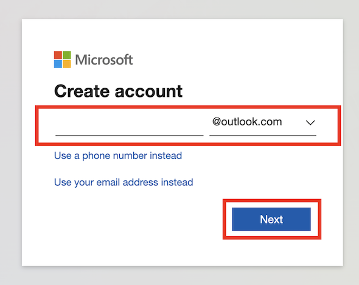
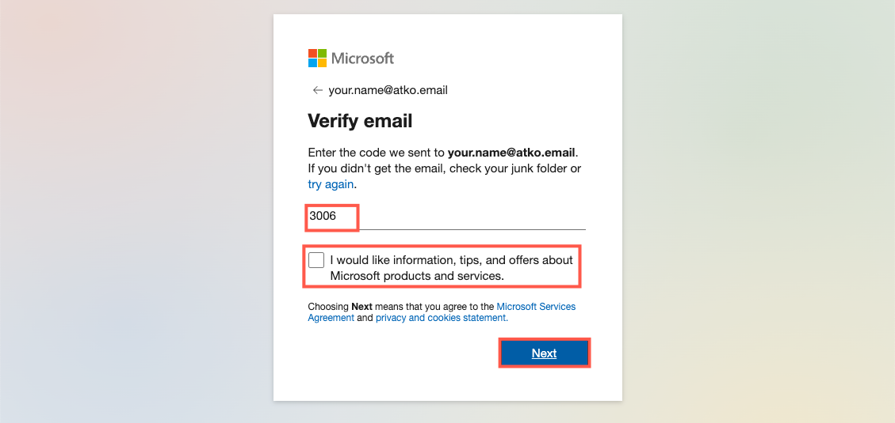
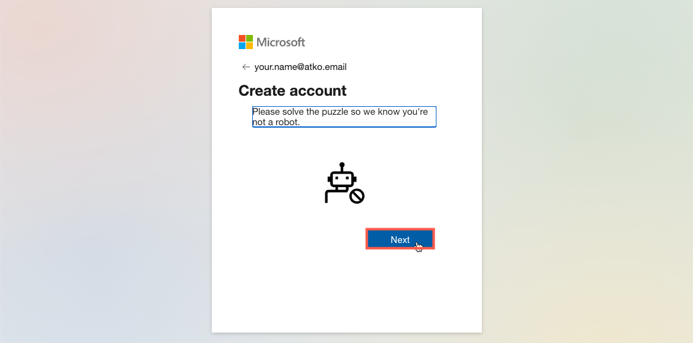
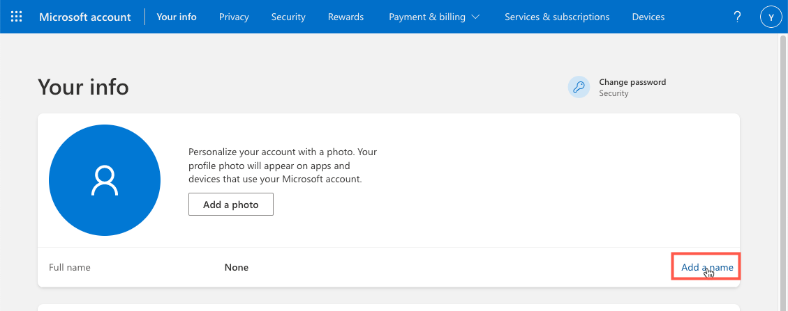
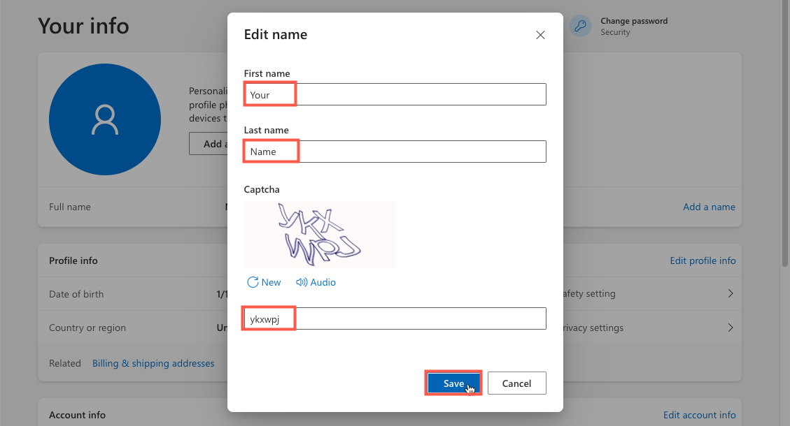
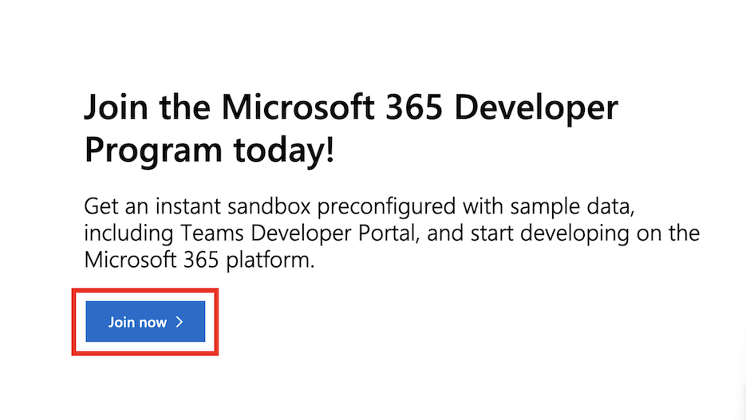
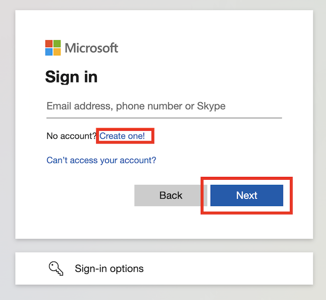

# Get Microsoft E5 sandbox

In order to demonstrate integration with Microsoft 365, you will need a Microsoft account with enterprise services enabled.  Rather than paying for a production tenant, you can get an E5 sandbox by joining the Microsoft 365 developer program.

This guide provides instructions for signing up for a Microsoft account and joining the Microsoft developer program.

In this guide, we will use a new outlook.com email address. You might prefer to sign up with your Okta email address or even use an existing personal Microsoft account.

## Register for a Microsoft account

In this section you will register for a Microsoft account. If you already have an existing account you can skip this section but it is probably better to create a dedicated account for use with your Okta demo environment.

> Note: At the end of this section you will have to wait up to one hour for your name to propagate to the developer site.  Plan this into your day.

1. Open a browser and navigate to: https://developer.microsoft.com/en-us/microsoft-365/dev-program
    
    You’ll see the following page:

    

2. Click **Join now**.
    
    The login page is displayed:

    

3. Click **Create one**

    

4. Enter the email address you want to associate with your developer account.
    You can use your email address or you can generate a new email address:
    a. Click on "Get a new email address"
        

    b. Register for a new email address. Use as name convention `{{idp.name}}`. So your email will be `{{idp.name}}@outlook.com`.
        
    > **Remember to save the password in a secure place, as you will need it later.**
    
    

5. Click Next

    

6. Create a password for your new account.

7. Click Next
    

8. Set your Country/region and Birthdate.

9. Click Next.
    A validation code is sent to your email address and a challenge page is displayed:
    

10. Retrieve the code sent to your email address and enter it on the verification page.

11. Clear the check-box so that you don’t get additional emails.

12. Click Next.
    

13. Click Next and complete the “I am not a robot” checks.
    
    At the end of these checks you may see the following error message:
    

    This message is seen because you have not entered your name as part of account creation and this is needed before you can join the developer program.

    - Click Close.
    
        You are taken to the profile page:
        
        

    - Click Add a name.

        

    - Enter your First name and Last name.

    - Complete the Captcha and click Save.

> Your account has now been created, and your name set in your Microsoft profile.  However, you will have to wait up to an hour for your name to propagate to the developer site so that you can join the developer program.

---

## Join the developer program

In this section you will join the Microsoft developer program.

1. Open a browser and navigate to: https://developer.microsoft.com/en-us/microsoft-365/dev-program
    
    You’ll see the following page:

    

2. Click Join now

3. The login page is displayed: 
    

4. Enter your email address and click Next.
    

5. Enter your password and click Sign in.

6. Click to decide if you want to stay signed in on this browser - it’s up to you.
    
7. Select your Country/Region and Language preference.
8. Enter your Company.

9. Check the checkbox to accept the terms and conditions
10. Clear the checkbox so you don’t get extra email.
11. Click Next.
    
12. Select a primary focus for your tenant and click Next.
    

13. Pick at least one development area and click Save.
    
14. Select Configurable sandbox.
    >You need to pick this option so that you can customize the domain for your sandbox. Although the description says this can take two days to provision, it is usually much quicker (can even be immediate).

15. Click Next.
    

16. Select the *Country/region* where your sandbox will be created.

17. Enter a username for your super admin user.  This can be whatever you like.

18. Set the domain for your sandbox. TODO: DOMAIN
    For consistency, this name should match the DNS domain name that you have purchased for your demo environment (if this name is not available, it doesn’t really matter - pick something else suitable).

19. Enter (and confirm) a password for your super admin user.
    This password must be at least 15 characters so you might want to use a password manager and let it generate one.

20. Check the details and then click Continue.
    

21. Enter a phone number to validate your developer sandbox.
    > You may see an error if you use a phone number that is already associated with a different Microsoft developer account.  You’ll have to use a different phone number. 
    TODO: PHONE NUMBER TEMPORARY

22. Click Send Code.
    The code is sent to your phone via SMS.
    

23. Enter the received code and click Set up.

    Your developer subscription is created.  While it is working you see this screen:
    

On completion, you will see this:

Your Microsoft developer E5 sandbox is now ready to use.

If you click Go to subscription you will be taken to https://office.com to login and access your system.

---

## Sign into your M365 tenant

Now that you have your new Microsoft E5 subscription, you can login to it at: https://office.com.

1. Click Sign in.
    

2. Enter your username.  You haven’t linked your DNS domain yet so you’ll need to use the format:
    <username>@<your demo domain>.onmicrosoft.com.
    TODO: USERNAME

3. Click Next.
    

4. Enter password and click Sign in.
    

5. You may see this screen.  If so, click Skip for now.
    >You don’t want to set up Multi-factor authentication in Microsoft because you’re going to enable it in Okta instead.  In the next section, there are instructions on disabling MFA in M365 which will prevent this from showing again.

6. A Stay signed in? Page is displayed.  You can decide if you want to stay signed in or not.
Your home page is displayed:
    

You are now signed into your M365 account.  You can see an Admin option on the menu which is where configuration is performed.

## Disable native MFA
In your demonstration environment, you will connect your Okta tenant with this M365 tenant.  All access to M365 will be via Okta and Okta will be responsible for user authentication, registration of additional authentication factors, and enforcing Multi-Factor Authentication in line with configured authentication policy.

To stop M365 from ALSO trying to perform MFA registration, and enforce MFA at login, you need to disable Multi-Factor Authentication in the M365 Administration pages.

1. If not already done, sign-in to your M365 tenant as an administrator user (see previous section).

    You should be on the welcome page:
    

2. Click the Admin button on the navigator bar.

3. Click Skip for now if prompted to secure your account.
(This is the message you’re about to disable).
    

4. In the admin center, type identity into the search bar.

5. Select Identity from the results.

6. Click Skip for now if prompted to secure your account.
    

7.You should already be on the Overview page.

8. Select the Properties tab.

9. Click Manage security defaults.

10. Set Security defaults to Disabled.

11. Select a reason (it doesn’t matter which one you pick)

12. Click Save.
    

13. Click the Disable button to confirm.

OK, that’s done.  Users will no longer be prompted to register for Multi-Factor Authentication by M365.  This will be handled by Okta (once you have integration set up).

## Add a custom DNS domain

In a Microsoft 365 tenant, single sign-on using an Identity Provider, such as Okta, cannot be enabled for the default domain.  Before you can set up single sign-on, you must add a custom DNS domain to your M365 tenant.

In this section, you will learn how to add a custom DNS domain to your M365 tenant.

If you don’t have a custom DNS domain to use, you can add another .onmicrosoft.com domain instead and use this for federation.  This will save the cost of a custom DNS domain.

### Start M365 Add Domain wizard

Follow these steps to add your DNS domain:

1. Navigate to the Admin center of your M365 account.
    

2. Type domains in the search bar

3. Select Domains from the results.
    

    On the *Domains page*, you can see the *onmicrosoft.com* domain.

4. Click **Add domain**.
    

5. Enter your *Domain name*.
    In most cases, it’s best to use a root domain but you can also register against a subdomain (e.g. ms.yourdemodomain.com) if you prefer.
    TODO DOMAIN NAME

6. Click Use this domain.
    Microsoft looks up the hosting service of the DNS domain you have provided.  If it is hosted by a supported provider (e.g. GoDaddy), automatic verification and configuration is offered:

    

7. Click Verify to start the verification process.
    A pop up window is opened to your hosting provider.

8. Authenticate to your hosting provider (e.g. GoDaddy).
An authorization confirmation request is shown:
    

9. Click Connect to allow Microsoft to access your DNS domain at GoDaddy for the purposes of domain ownership verification.
    The connection is used to obtain proof of ownership for your DNS domain.  When complete, the pop up window closes and you are returned to the Microsoft setup wizard:
    
    On this page you can select how you will add the required DNS entries to your DNS provider.  The default option for GoDaddy domains is to have this done automatically.

10. Click Continue.
    

11. Click Add DNS Records.
    A new browser pop-up is opened for GoDaddy.  You might need to authenticate again.  Once authenticated, you will see another authorization request:
    

12. Click Connect to allow Microsoft 365 to add required DNS entries to your DNS domain.

    Setup is performed.  This may take a few seconds.  When complete, the GoDaddy pop-up closes and the M365 Add Domain wizard reports success:
    

13. Click Done.
The Domains page shows that your custom domain is the default domain for the M365 tenant and is Healthy.

## Make onmicrosoft.com domain the default

When your custom domain is created, it is automatically set as the default domain.  This is a problem because the default domain cannot be configured for Single Sign-On.  You must now configure the onmicrosoft.com domain as the default domain.

1. Select the onmicrosoft.com domain.

2. Click Set as default.
 

3. Click **Set as default** in the confirmation dialog.
    The *onmicrosoft.com* domain is now shown as the default:
    

Your initial Microsoft 365 tenant configuration is now complete.  You are ready to configure integration with Okta for Single Sign-On and Provisioning.

## Create an Office 365 Dev (Free) Tenant

1. Register for a free Microsoft Dev Account

    1. Open the website https://developer.microsoft.com/en-us/microsoft-365/dev-program

    2. Click on "Join Now"
    

    3. Create a new account by clicking on "Create One!"
    

    4. Click on "Get a new email address"
    

    5. Register for a new email address. Use as name convention `{{idp.name}}`. So your email will be `{{idp.name}}@outlook.com`.

        > **Remember to save the password in a secure place, as you will need it later.**

        

    6. Complete the registration form by putting your information. We suggest to keep English as language.
       

    7. Click on "Set up E5 subscription"
      

    8. Select "Configurable Sandbox"
      

    9. Complete the Microsoft 365 E5 sandbox form.
        
        Use `admin` as username and `mywiclabNAMESURNAME` as domain.
        
        > **Remember to save the password in a secure place, as you will need it later.**
     

        

    10. Complete the registration by inserting your phone number and complete the validation challenge using the OTP that you receive by SMS
          

          >  To resume:
          >  - Your Office 365 Tenant:  mywiclabNAMESURNAME.onmicrosoft.com
          >  - Your Admin Account:      admin@mywiclabNAMESURNAME.onmicrosoft.com
          >  - Your Email Address:      my{{idp.name}}@outlook.com

2. Configure you Microsof 365 Tenant
    1. Open the website https://www.office.com/login?login_hint=admin@mywiclabNAMESURNAME.onmicrosoft.com and login using your password

    2. Create a new domain **`wiclabNAMESURNAME.onmicrosoft.com`**
    
          > **NOTE: the name is the same of the O365 tenant, without the word `my` at the beginning.**

           TODO: COMPLETE - subdomain registration

        > To resume:
        >  - Your Office 365 Tenant: mywiclabNAMESURNAME.onmicrosoft.com
        >  - Your Admin Account:     admin@mywiclabNAMESURNAME.onmicrosoft.com
        >  - Your Custom DNS Domain: wiclabNAMESURNAME.onmicrosoft.com

---