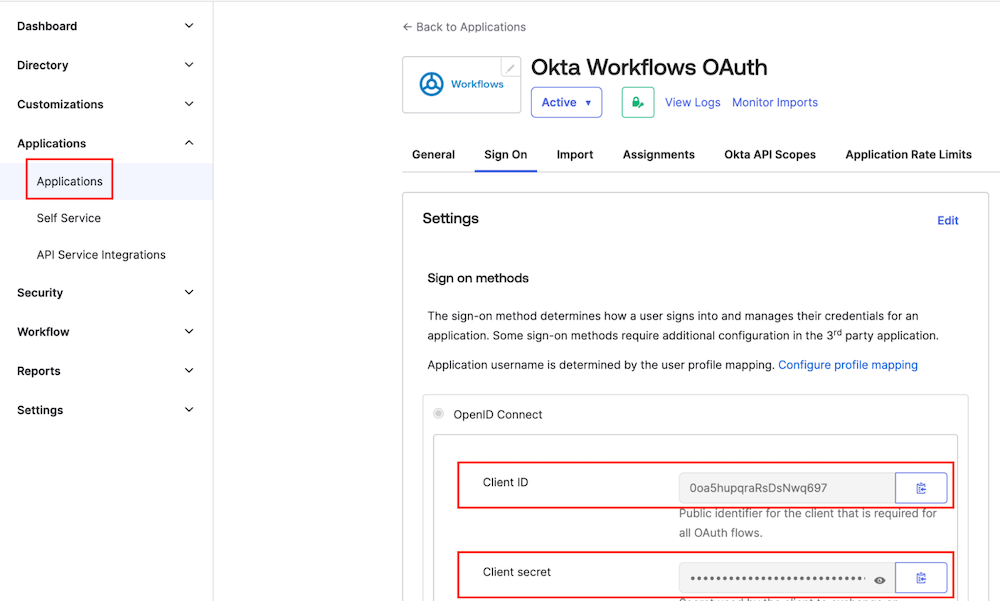
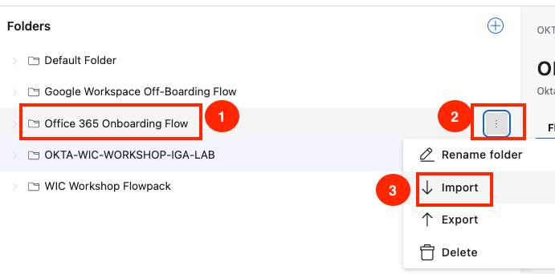
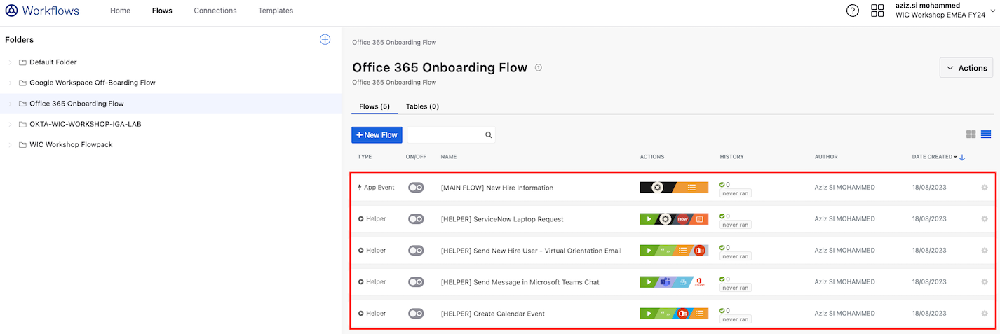
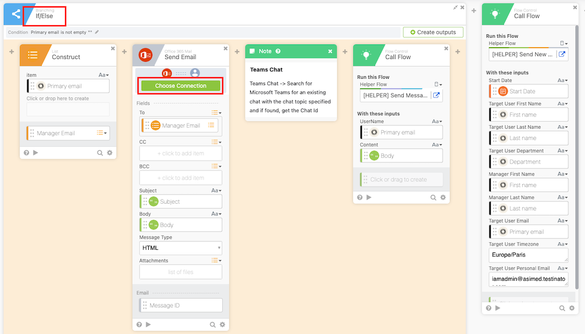
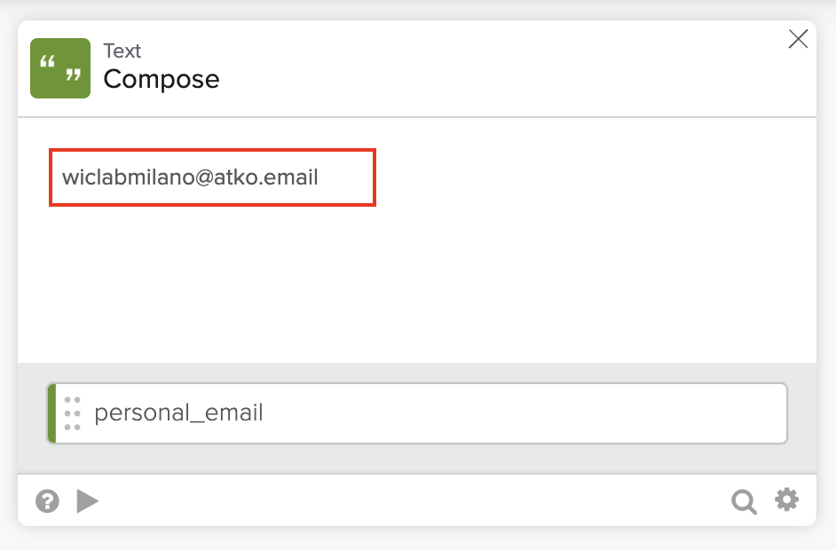
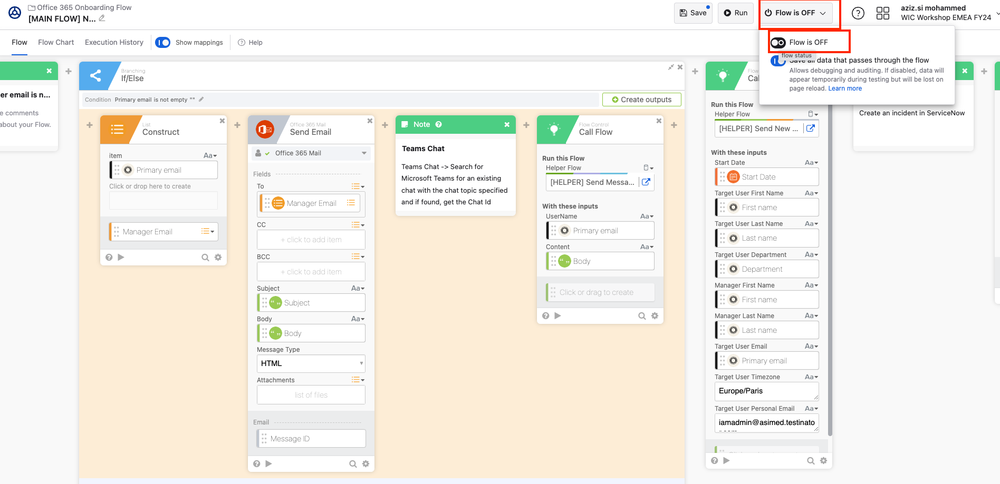
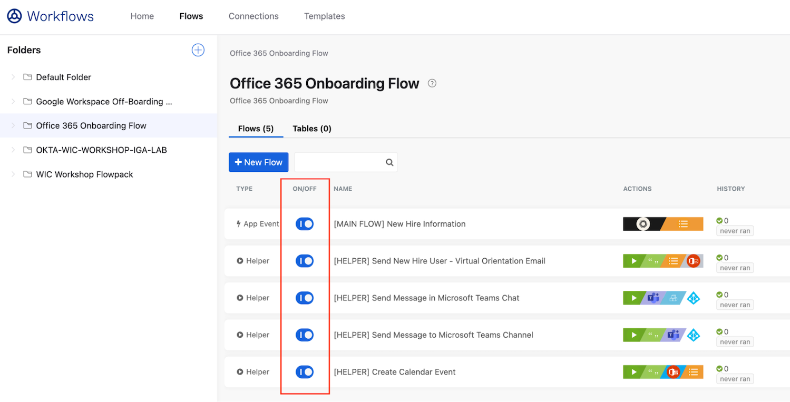

# Okta Workflows

TODO: Istruzioni per creare le utenze Wes Chang e  **Giorgia Rossi** e metterli nel gruppo O365Users.

Okta Workflows can be used to augment Lifecycle Management and provide custom logic for organization-specific use cases. Okta Workflows is a no-code automation platform that enables admins to modernize ever-more-sophisticated identity-centric processes without leaning on developers. It provides a graphical drag-and-drop interface that combines triggers, logic, and time-based actions to build powerful “if-this-then-that” flows. As a result, anyone can easily stitch together app-specific provisioning and deprovisioning tasks. For instance, with Okta Workflows, you can leverage Okta’s library of pre-built connectors for apps like Box, Slack, Salesforce, and more (or connect via public APIs) to tailor processes with deeper actions that meet your precise requirements.

With out-of-the-box functions for flow control, branching, and data manipulation, Okta offers the power of code without code, and it is finally possible to orchestrate identity tasks that were previously just too hard to automate. By having this capability built-in to your identity architecture, your team will increase agility and decrease costs, all while facilitating constant business change and improving your company’s security posture.

Here are a few ways Okta Workflows can automate complex identity scenarios:

1. Take granular actions during onboarding and offboarding

2. Resolve identity creation conflicts

3. Define identity processes based on time, role, and other factors

4. Distill and share identity insights

---

## Lab description

The purpose of this Workflow pack is to perform various tasks in Office 365 when a given target user is being onboarded from the HR System in the organization as a whole. This flow pack is triggered when a user is created.  The effects of this Workflow on the Office 365 account are as follows:

**Virtual Orientation:** The new hire user will be sent a virtual orientation email complete with Microsoft Teams link to the new hire’s work as well as personal email.  (The work email is as defined in Okta Universal Directory in the email attribute and the personal email will be defined by the secondary email attribute in Okta Universal Directory).

There will also be a calendar invite sent to the new hire user for the virtual orientation session, 7 days out from the date the new hire is created and this flow pack is executed.

**Microsoft Teams:** The new hire user will be added to a Microsoft Teams. The new hire user is also added to a Microsoft Teams private channel that you create ahead of time. The format of the private channel is “Department - <department in the new hire users department attribute in Okta Universal Directory>”

If the channel for that department does not exist, it will be created at the time the new hire user is assigned to the channel.  
  
Additionally a welcome message is sent to that private channel welcoming the new hire user.  

---

## Lab Prerequisites

For the workflows in the Okta Workflow Pack to work you will need:

### You will need to configure the following Okta connectors in your Okta Tenant that has workflow enabled

#### Configure Okta Connector:

1. From Okta Admin Console, go to Workflows console under Workflow section
   

2. Go to Connections tab and click New Connection

   

3. Select Okta connection from the list

   

4. Configure you Okta connection, you will need

   3.1. Okta domain name of your tenant (without the https): **`{{idp.name}}.okta.com`**

   3.2. Okta Workflows App client ID and Client Secret, to get them, go to Okta Admin console under Applications > Applications and search for **Okta Workflows OAuth** application.

   

   3.3. The configuration will look like this, click on **Create** button

   

5. Configure Office 365 Admin connector

   4.1. Go to Connections tab and click **New Connection**

   4.2. Select Office 365 Admin from the list and click **Create**

   

   4.3. Log in with your Microsoft O365 Admin account if you are not already logged in.

   4.4. Check the box **Consent on behalf of your organization** and click on **Accept**

   

6. Configure Office 365 Mail Connector: follow the same steps to configure it

   

7. Configure Office 365 Calendar Connector: follow the same steps to configure it

   

8. Configure Microsoft Teams Connector: follow the same steps to configure it

   

### Additional prerequisites

1. An existing user (that will represent the manager user) in Okta and Office 365 **where the username in Okta and in O365 are the same (the user’s email address)**. 

   The manager user’s email address needs to point to a valid email address and have the appropriate Office 365 licenses so that the manager can get the email notifications as part of the flow.
   
   In this lab we will use the manager account **Wes Chang**:

   Create a user with the following data:
   | | |
   |-|-|
   |Username   | wes.chang@wiclabNAMESURNAME.onmicrosoft.com |
   |Name       | Wes |
   |Surname    | Chang|
   |Email      | wes.chang@wiclabNAMESURNAME.onmicrosoft.com |
   |Department | Sales |

   Remember to select **I will set password** and remove the check from **User must change password on first login**

2. An existing target user (that will represent the target user) in Okta where the **Okta Primary Email Address for that user is the same as the user’s Office 365 username**. The manager attribute in Okta Universal Directory will need to be the username of the Okta user that represents the manager and you created in the step above.
   
   **This target user must be assign to Office 365 application.**
   
   In this lab we will use the user account **Giorgia Rossi** created in Okta.

   Create a user with the following data:

   | | |
   |-|-|
   |Username   | giorgia.rossi@wiclabNAMESURNAME.onmicrosoft.com |
   |Name       | Giorgia |
   |Surname    | Rossi|
   |Email      | giorgia.rossi@wiclabNAMESURNAME.onmicrosoft.com |
   |Department | Sales |
   |Manager      | wes.chang@wiclabNAMESURNAME.onmicrosoft.com |
   |ManagerId     | wes.chang@wiclabNAMESURNAME.onmicrosoft.com |

   Remember to select **I will set password** and remove the check from **User must change password on first login**

---

## Okta Workflows - Flow Pack Setup Steps

### Initialisation instructions

**Please download the flowpack below (right click -> Save link as)**

https://raw.githubusercontent.com/fabiograsso/WIC-Lab-Milan-202312/main/files/o365OnboardingFlow.folder

1. Go to the Okta Workflows Console from the Okta Admin Console

   

2. Go to Flow Tab and click on Add new folder **(+)** icon positioned on top left of the screen

   

3. Create a new folder called **Office 365 Onboarding Flow**

   

4. Import the office365OnboardingFlow.folder into this newly created folder by clicking on the three dots at the right of the folder name

   

5. The folder structure should look like the following one

   

6. Open the first flow **MAIN FLOW** New Hire Information by clicking on its name

7. Scroll to the right, you will see the card Send Email inside the If/Else Card, click on the Choose Connection

   

8. Select the connection you create in the previous steps

   

9. Change the `personal_email` value. This email will be used to send an introduction email to the user and also as a 'cc' for the message to be sent to the manager.
   
   > You can use your email address, or you can use a temporary one using services like [Mailinator](https://www.mailinator.com/) or [Maildrop](https://maildrop.cc/).

   

10. Activate the flow

   

10. If you have not already done so, authorize the connections to Azure Active Directory, Microsoft Team, Office 365 Mail, Office 365 Calendar and Okta.

11. **Make sure that the following Okta Workflow cards have valid connections assigned: open ALL THE FLOWS and verify that all the connections are correctly setup**

   

12. Toggle all the flows from Off to On

   

---

## Testing the Okta Workflow Flow

Create or import a new user with a manager assign (in our case **Giorgia Rossi**) and assign her **Office 365 application**.

In the example below, we have created the user **Elise Dupont** in Okta and assign **Wes Chang** as manager from the user profile.

In order to put the manager, go to **Profile**, click **Edit** then scroll down to the manager ID attribute and enter the value **wes.chang@wiclabNAMESURNAME.onmicrosoft.com**, enter **Sales** in the **Department** attribute.

You will be able to visualise the flow execution in real time by clicking on "Execution History" on the main flow.

### Expected Result

On the manager profile (**Wes Chang**) you will see : 

- A new email auto generated

   

- A new chat message in Teams

   

On the new user (Elise Dupont) profile you will see : 

- A welcome email

   

- A channel in Teams "OKTA EMEA WIC Lab"

   

- A new calendar invitation

   

---

Congratulations! You have successfully configured an onboarding Workflow!