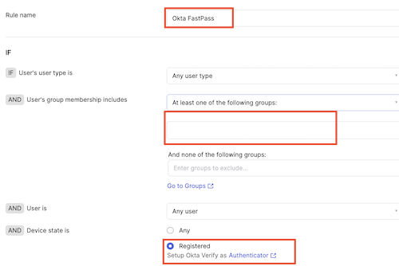
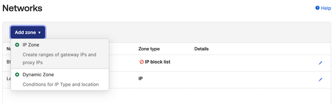

In this lab, you will unlock the combined power of Okta Verify and FastPass. You will enable an experience where passwordless authentication becomes an integral part of an employee’s workday, boosting employee productivity without the common password pitfalls. Not only will you discover an enhanced security posture resistant to phishing threats, but you’ll also appreciate the inherent protection it offers, sometimes even against our own human errors.

---

## Setup Okta FastPass on the Virtual Desktop

### Install Okta Verify on your Virtual Desktop

1. In the **Virtual Desktop**, download the **Okta Verify** setup: https://{{idp.name}}.okta.com/api/v1/artifacts/WINDOWS_OKTA_VERIFY/download?releaseChannel=GA

1. Run the executable

2. In the Okta Verify installation window, select **I agree to the License terms and conditions**, and then click **Install**.
    Wait for confirmation saying that Okta Verify was successfully installed.

3. Click **Finish**.

4. Close the **Download** window.

### Add New Employee Account to Okta Verify

1. In the **Virtual Desktop**, open the **Okta Verify** application.

2. On **Welcome to Okta Verify**, click **Get started**.

3. Click **Next**.

4. For **New Account**, enter `https://{{idp.name}}.okta.com`
    |||
     |:-----|:-----|
     || |

5. Click **Next**.
This will open your Okta tenant's sign-in page.

6. Sign in with the username and password of an existing user (e.g. **`emily.boone@oktaice.com`**).

7. Close the Okta Verify window, and then close the browser.

---

## Configure Security Policies and FastPass

### Enable Okta Verify for FastPass Authentication

1. Return to your **Okta Admin Console** browser session.

2. In the Admin Console, select **Security** > **Authenticators**.

3. For **Okta Verify**, click **Actions**, and then select **Edit**.

4. For **Okta FastPass** select **Show the "Sign in with Okta FastPass" button**.
    |||
   |:-----|:-----|
    ||

5. Scroll down and click **Save**.

### Add a rule to the Standard Security Apps policy

1. In the Admin Console, select **Security** > **Authentication Policies**.

2. Select the  **Standard Security Apps** authentication policy.

3. Click **Add Rule**.

4. Set the **Rule name** to **Okta FastPass**

5. Set the following **IF** conditions for the rule:
    | IF | Value|
    |:-----|:-----|
    |User's  type is| *Any user type* |
    |User's group membership includes|**At least one of the following groups:**|
    | Enter groups to include: |  **Digital Marketing** and **Digital Sales**|
     | Device state is: |  **Registered**|'

    |||
   |:-----|:-----|
    ||

6. Set the following **THEN** access and authentication settings for the rule:

    |THEN||
    |:-----|:-----|
    |User must authenticate with:| **Possession factor**|
    |If Okta FastPass is used |**The user is not required to approve a prompt in Okta Verify or provide biometrics**|

    |||
     |:-----|:-----|
    ||

7. Click **Save**.

8. Click and drag the vertical dots control to move the **Okta FastPass** rule up to **Priority 1** in the list of rules for the policy.
    |||
     |:-----|:-----|
    ||

---

## Experience an Employee Passwordless Login

1. Return to your **Virtual Desktop**.

2. In the Virtual Desktop, launch a Chrome browser using the **Chrome** shortcut on the desktop.

3. You will  automatically be authenticated to your End-User Dashboard. No prompts, no typing, pure magic!

4. Sign out of Okta.

5. At the Okta login, click **Sign in with Okta FastPass**. Again, you will be signed in to the End-User Dashboard, no password required.

---

## Set Up Device Assurance

### Add a Device Assurance Policy

With device assurance policies you can check security-related device attributes as part of your authentication policies.

1. Return to your **Okta Admin Console** browser session.

2. In the Admin Console, select **Security** > **Device Assurance Policies**.

3. Click **Add a policy**.

4. Set **Policy name** to **Windows 11**

5. For **Platform**, select **Windows**.

6. For **Minimum Windows version**, select **Windows 11 (22H2)**.

7. For **Lock Screen**, deselect **Windows Hello must be enabled**.

8. Click **Save**.

    |||
   |:-----|:-----|
    ||

### Modify High Security Apps Policy to include Device Assurance Policy

1. In the Admin Console, select **Security** > **Authentication policies**.

2. Click **High Security Apps**.

3. For the **Windows 11 or higher** Rule, click **Actions**, and then select **Edit**.

4. In the **IF** conditions, set **Device assurance policy is** to **Any of the following device assurance policies:**,  and then select **Windows 11**.
    |||
   |:-----|:-----|
    ||

5. Click **Save**.

6. For the **Windows 11 or higher** Rule, click **Actions**, and then select **Activate**.

### Add Marketo to the High Security Apps Policy

1. In the **High Security Apps** policy, select the **Applications** tab.

2. Click **Add app**.

3. Locate **Marketo** in the list of apps, and then click **Add**.

4. Click **Close**.
    |||
     |:-----|:-----|
    ||

---

## Test the Device Assurance Policy

1. Return to your **Virtual Desktop**.

2. In your Virtual Desktop, open the **Okta Verify** app.

3. On the **Accounts** page, click the device health icon to verify that your OS version is version 10.
    |||
   |:-----|:-----|
    ||

4. In your Virtual Desktop, sign into your Okta tenant as your new employee.

5. Select the **Marketo** app. You will be denied access because your device does not meet the device assurance policy.

    |||
    |:-----|:-----|
    ||

---

### Switch the Authentication Policy for Marketo

1. Return to your **Okta Admin Console** browser session.

2. In the Admin Console, select **Security** > **Authentication Policies**.

3. Select **High Security Apps** > **Applications** tab.

4. For the **Marketo** app, click **Switch Policy**.

5. Select the **Standard Security Apps** policy, and then click **Save**.
    |||
     |:-----|:-----|
      ||

6. Return to your Virtual Desktop and verify that your new employee can now access the **Marketo** app.

    |||
     |:-----|:-----|
      ||

**Note:** With the exception of Office 365, the apps in this lab are Bookmark apps. Bookmark apps are used to direct users to a specific web page. Real app integrations do exist in the Okta Integration Network for all of the apps shown in this lab.

---

## Enable Okta ThreatInsight

Okta ThreatInsight aggregates data about sign-in activity across the Okta customer base to analyze and detect potentially malicious IP addresses and to prevent credential-based attacks such as: password spraying, credential stuffing, and brute-force cryptographic attacks. Because ThreatInsight collects information about the origin of sign-in activity directed at Okta organizations and Okta endpoints, it provides a security baseline for all Okta customers.

To enable Okta ThreatInsight, proceed with the following steps:

1. Return to your **Okta Admin Console** browser session.

2. In the Admin Console, select **Security** > **General**.

3. Scroll down to Okta ThreatInsight settings and click **Edit**.

4. Select **Log and enforce security based on threat level**.
This setting will make Okta automatically deny access to sign-in requests that come from potentially malicious IP addresses that ThreatInsight detects.

5. Click **Save**.

---

## Contextual Access & Device Management (optional)

If you have time please feel free to add network and behavior detection rules to your tenant.

### Networks & Zones
1. Navigate to **Security -> Networks**.

2. There are two default Zones already configured. *BlockedIpZone* and *LegacyIpZone*.
    

3. We are going to add a trusted IP Zone containing our computer address. To do this click **Add Zone -> IP** Zone as shown below.
    

4. Name the new zone Trusted Enterprise Network or similar and click on the address next to **Add your current IP address**. This will add your computer's address to a trusted list and we can later use this in Authentication Policies.
    

5. Next we can add a Dynamic Zone to block access from Tor proxies.  To do this click **Add Zone -> Dynamic Zone**. Check *Block access from IPs matching conditions listed in this zone* and from the **IP type** drop down select *Tor anonymizer proxy* as shown below.
    

6. Your *Networks* list should now look similar to the following.
    

> #### Note
> * Adaptive SSO or Adaptive MFA licenses are required to  leverage Dynamic Zones
> * At a later stage if you would like to see what is added to Okta Logs when an IP is blocked you can add your computer IP to the BlockedIpZone by clicking on the pencil Icon at the end of the line and then clicking on your current IP address as shown below. Please ensure you remember to remove  this setting afterwards if you wish to test other policies in more detail.
> 

### Behavior Detection (Information only)
1.  Navigate to **Security -> Behaviour Detection**.
    
2. Here you can see and adjust a wide range of behaviors. These can be later used in authentication policies either leveraging the Risk level Okta assigns or specifically by evaluating specific behaviors in a custom expression. See the (Okta Expression language documentation)[https://developer.okta.com/docs/reference/okta-expression-language-in-identity-engine/] for more details.

> #### Note
> Location data is provided by a third-party geolocation service. Okta updates the geolocation IP data on a weekly basis.

### Device Integrations (Information only)

Device Integrations are used to link Okta with endpoint management systems such as InTune, JAMF etc. We will not be leveraging these device integrations during this workshop.
1. Navigate to **Security -> Device Integrations**. Here you will see three tabs.
2. The first and second tabs *Endpoint Management & Certificate Authority* allows you to add a device management platform, such as JAMF or Intune, and the associated trusted certificate chain. You can find more details on specific configuration in the (documentation)[https://help.okta.com/oie/en-us/Content/Topics/identity-engine/devices/managed-main.htm].
    
3. The third tab Endpoint Security allows you to integrate with CrowdStrike or Windows Security Center to leverage signals directly from the endpoints during authentication policy evaluation.
    

---

## Dectecting & Responding to Phishing Attacks
In this section, we will look at how you can enable Okta Fastpass to detect and respond to real-time phishing attacks caused by AiTM services like EvilGinX. **This guide will not cover setting up of EvilGinX.**

In the previous lab section, you’ve already learned how to enable Okta Fastpass as an Authenticator for your end-users.

The next section will focus and discuss on how you can leverage Fastpass to detect and respond to Phishing attacks targeted by threat actors to your end users.

One benefit of using Okta Fastpass is that by default it already inherits phishing resistant qualities meaning it is able to automatically detect if the site is a phishing site or legitimate site. If it is a phishing site, automatically, it will provide an end-user friendly message to your end users.

The only prerequisite to have this feature/capability enabled is to make sure your end-users are running the latest version of Okta Fastpass and have their Okta account enrolled with it.
From an administrator level, the only task you need to do is to create a rule within your Authentication Policy that leverages Fastpass as the authenticator of choice. Always remember that phishing sites will always try to farm your end-user’s password by imitating your identity provider’s authentication/login page/screen/service. The goal is to not allow your end-users to not use a password or non-phishing resistant authenticators as part of the authentication process such that nothing is shared or stored to your attacker’s service.

### Create a Phishing proof Authentication Policy rule

1. Navigate to any one of your Authentication policies and create a new rule.
    
2. If we inspect the rule closely, this is what should be defined from a policy decision point perspective:
    
3. From a policy enforcement point perspective, this is what should be defined:
    
4. Click **Save** and make sure the rule is ranked as one of the highest ranking of your authentication policy.

> During this lab we will not setup an **EvilGinX** instance for demostrate the phishing resistance.
>
> You can watch this video for a demo: [Detect, Prevent and Protect Phishing Attempts through Phishing Resistant Authenticators by Okta](https://www.youtube.com/watch?v=25Ab5_zvbAM&t=2s)
>
> Or you can try at home to run an EvilGinX proxy and emulate an attacker!

### Adding Observability and Workflows (Information only)
Okta logs every transaction and processed event within the platform. All of these logs are kept and accessible via Okta’s System Log. Okta also provides extensibility points within the platform through Hooks. One type of hook that we can leverage here is [Event Hooks](https://help.okta.com/oie/en-us/Content/Topics/automation-hooks/event-hooks-main.htm?cshid=ext-event-hooks). 
You can define multiple Event Hooks within the Okta platform. Navigate to **Workflow -> Event Hooks**.

You can do the following instructions at your own time or pace. You can create Event Hooks that will meet your requirements and specifications. The example Event Hooks workflow we will define below will intercept and Phishing Attacks declined by Okta Fastpass. 

1. Click Create Event Hook 
    
2. Supply an Endpoint URL, Event Hook Name and description. 
    
3. Let’s leave the Customise Request as default.
4. Let’s select a specific event.
    
5. Click Next and let’s apply a filter.
    
6. Click the Use Okta Expression Language (advanced)
    
7. Use the following filter `event.outcome.reason eq "FastPass declined phishing attempt"`. Click **Save**.

8. Make sure you also verify the Event hook you created by following the instructions here.

---

## Conclusion

In this lab, we've journeyed beyond traditional barriers, tapping into the wonders of Okta Verify and FastPass. Goodbye, cumbersome passwords and hello, sleek passwordless wonders! Together, we’ve fortified our defenses against those sneaky phishers and, yes, even our own little mishaps. Here's raising a toast to a future of ease, enhanced security, and fewer facepalms!