# Initial Setup

## Add a user, a group, and an app

In this lab you will add a user, add a group, and then add the user to the group. You will also create a bookmark app in your Okta org.

### Add a user

In this task, you will add a test user.

1. In the Admin Console select **Directory** > **People**.
1. Click **Add person**.

1. Set **First name** to **Work**.
1. Set **Last name** to **Shop**
1. Set **Username** to an email address that you can access during the workshop.
1. For **Activation**, select **Activate now**.
1. Select **I will set password**, and then enter a password.
1. Clear **User must change password on first login**.
1. Click **Save**.

1. Optional. Refresh your browser to see the new user.

### Add a group

In this task you will add a new group.

1. In the Admin Console select **Directory** > **Groups**.
1. Click **Add group**.
1. Set the **Name** to **High Assurance**.
1. Optional. Set a **Description**.
1. Click **Save**.

1. To view the new group, refresh the browser.
1. Select the **High Assurance** group, and then click **Assign people**.
1. Search for your new user, and then click the **+** sign to add the user to the group.
1. Click **Done**.

### Add an app

In this task you will add a bookmark app for testing authentication policies.

1. In the Admin Console select **Applications** > **Applications**
1. Click **Browse App Catalog**
1. In the search bar, enter **bookmark**, and then click **Bookmark App**.

1. Click **Add Integration**.

1. Set the **Application label** to **High**.
1. Set the **URL** to  <https://www.okta.com/workforce-identity/#device-assurance>
1. Click **Done**.
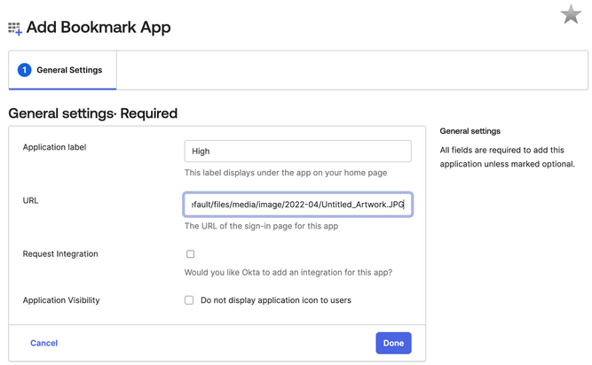
1. On the **Assignments** tab, click **Assign** and then select **Assign to Groups**.
1. Search for the **High Assurance** group and then click **Assign**.
1. Click **Done**.

---
# Security and Authenticators

In this lab we dive into the Security Section of the Administration portal including general setup and authenticators.

## Security Configuration

This section contains various global org security settings such as: security notification emails, CAPTCHA integration, and Okta ThreatInsight.

1. In the Admin Console select **Security** > **General**.
1. In **Security notification emails**, click **Edit**.
1. Enable all of the options, and then click **Save**.

1. In **Okta ThreatInsight settings**, click **Edit**.
1. For **Action**, select **Log and enforce security based on threat level**.
1. Click **Save**.

1. Select **Security** > **HealthInsight**.
HealthInsight audits an org's security settings and suggests tasks that improve security posture.

## Add Authenticators

Now we will investigate authenticators in more detail. Your Okta org has some preconfigured authenticators with various factor types and method characteristics. Factors can be used for Recovery or Authentication or both.

1. Select **Security** > **Authenticators**.

1. Click **Add Authenticator**.
1. Locate **FIDO2 (WebAuthN)**, and then click **Add**.
On **General settings**, review the default setting for **Leave User Verification** as  **Discouraged**.
1. Click **Add**, and you will be taken to **Authenticator settings**.
1. To add another authenticator,  click **<- Back to all Authenticators**.
1. Click **Add Authenticator**.
1.Locate **Google Authenticator**, and then click **Add**.
1. Click **Add**.
**Note:** This authenticator can be used with any TOTP app such as Google Authenticator, Authy, iCloud Keychain etc.

## Configure Okta Verify & FastPass

Now we will review and adjust the settings on some pre-enabled authenticators, specifically Okta Verify and Passwords

1. Navigate to  **Security** > **Authenticators**.
1. For the **Okta Verify** authenticator, click **Actions**, and then select **Edit**.

1. Review the **Verification options**.

1. For **Okta FastPass**, select **Show the "Sign in with Otka Fastpass" button**.

1. For **Push notification: number challenge**, select **All push challenges**.

**Note:** At a minimum, Okta recommends selecting **Only for high risk sign-in attempts**.

## Enable Email as a Factor

In order to disable Passwords in Authentication policies the email factor needs to be allowed for both Authentication and recovery, this is required for Passwordless authentication later.

1. Navigate to **Security** > **Authenticators**.
For the **Email** authenticator, click **Actions**, and then select **Edit**.
1. For **Used for**, select **Authentication and recovery**.
1. Click **Save**.

## Enrollment Policies

Within policy, you can create Authenticator Enrollment rules which specify enrollment as optional or required for end users. In this lab you will create an enrollment policy that specifies email and Okta Verify as required and password as optional.

1. Navigate to **Security** > **Authenticators**, and then select  **Enrollment** tab.

1. Click **Add a policy**.
1. Set **Policy name** to **High**.
1. Optional. Set a **Description**.
1. For **Assign to groups**, enter **h**, and then select the **High Assurance** group.
1. For **Eligible authenticators**:
   1. Set **Email** to **Required**.
   1. Set **Okta Verify** to **Required**.
   1. Set **Password** to **Optional**.
1. Click **Create Policy**.

1. For the policy rule, set **Rule name** to **Default Rule**, and then click **Create Rule**.

>**TODO:** Need updated images
>

## Device Assurance Policies

Device Assurance Policies leverage Okta Verify to capture device signals, such as OS version, that can be leveraged in Authentication policy decisions.

In this lab, you will create a device assurance policy that will fail for a computer with Okta Verify installed. The simplest way to do this is pick a OS Version one higher than your current device is using. The policy requires an iOS device to has an iOS version one higher than the current release. We have also require a Passcode and biometrics, either TouchID or FaceID, must be enabled.

1. In the Admin Console select **Security** > **Device Assurance Policies**.
1. Click **Add a policy**.
1. Set **Policy name** to **iOS Assurance**.
1. For **Platform**,  select **iOS**.
This will expand the dialog window.
1. For **Minimum iOS version**, select **Customize**, and then set **Major** to **18**.

1. For **Lock Screen**, select **Touch ID or Face ID must be enabled**.
1. Click **Save**.

1. On the **Device Assurance Policies** window, in the **User help** section, click **Edit**.
1. For **Help display**, select **Display device error remediation in the browser when access is denied**.
This will provide stronger feedback to us later in our labs.
1. Click **Save**.

---
# Authentication Policies

In this lab we will look at Contextual Access options and device Management

## Global Authentication & Session Policy

1. In the Admin Console select **Security** > **Global Session Policy**.
1. For **Default Policy** click **Add rule**.
1. Set **Rule name** to **Defer to Apps**.

>Keep the default settings as they will allow ANY factor that has been defined in an application specific authentication policy. Essentially we are deferring the authentication decision to more specific policies.
>

1. In the **Session management** section:
   1. For **Maximum Okta session lifetime** select **Set time limit (Recommended)**
   1. Set the **Maximum Okta session lifetime** to **12** **Hours**.
   1. Set the **Expire session after user has been idle...** to **30** **Minutes**.
1. Click **Create Rule**.

>**Note:** You can create shorter policies for specific applications later.
>

## Standard Authentication Policies

Okta provides pre-defined authentication policies with options for any two factors or seamless access based on risk context. There are also pre-defined policies for the Okta Dashboard and the Okta Admin Console.

In this lab you will review the default authentication policy, and review what apps have this policy assigned.

1. In the Admin Console select **Security** > **Authentication Policies**.

1. Click on the default policy named **Any two factors**.
1. Select the **Applications** tab and you’ll see the list of apps that have this poicy assigned.

1. Click **Actions** to view the available options: Edit, Clone, Merge and Delete.

## Test authentication and review logs

1. In a new incognito window, sign in to your org with the **Username** (email address) of the user you added in the first lab.
1. Click the **High** app and you will be redirected to the specificed URL.
1. To view the Okta logs, return to your original browser.
1. In the Admin Console select **Reports** > **System Log**.
 In the System log you will see a log in action taken by your user. For example I have Bart Simpson below.

1. Select **Bart Simpson**.
This will create a search for all actions taken by this user.

1. Click the **>** icon.
**TODO** Need image with red box around icon - too hard to describe.
You will see more detail regarding the event.
In this case that Bart Simson is trying to sign-on to the Bookmark App and has triggered the Catch All policy.

1. To view the geographical context captured by Okta, click the expand **>** icon for the **Request**  .
1. To view the debug data captured by Okta including the device context this expand the following **System** > **DebugContext** > **DebugData**. You will see details including: **AuthnRequestId**, **TODO** add more based on explicit run.

1. Verify that this event is low risk. Compare this with the other log events for this new user and you’ll see that the initial login and enrolment events are high risk.

## Device Assurance

In this section you will enroll your computer into Okta Verify and run device assurance tests.

1. Return to the browser profile/incognito session for your test user.
1. Open the **Okta Verify** app on your laptop, and then click **Use another account**.
1. Enter the sign-in URL for your org, and then click **Next**.
You will be prompted to reauthenticate in the browser.
1. Sign in using the test user's username and credentials, and follow the prompts to enroll in biometrics.

1. Once you have completed this process open Okta Verify again and click on the shield Icon as shown below. If you don’t have access to Okta Verify on your laptop you can also see this information on your mobile device.

1. You’ll then see a screen like the below which indicates the status of the device health and what information can be seen in the device assurance policy.

1. In the Admin Console select **Security** > **Authentication Policies**, and click **Add a Policy**.
1. Set **Name** to **Device Assurance**.
1. Set **Description** to **Device assurance lab**, and then click **Save**.
1. Click **Add rule**, and then set **Rule name** to **Test Deivce Assurance**.
    1. Set **User’s group membership includes** to **High Assurance**.
    1. Select **Device state is** as **Registered**.
    1. Set **Device Assurance is** to **Any of the following device assurance policies**, and then select the device assurance policy you created earlier that will fail, called **iOS Assurance** .
    1. Set **User must authenticate with** to **Any 1 factor type**
    1. Click **Save**.

1. For the **Catch-all Rule**, select **Actions**, and then click **Edit**.
1. Set the **THEN Access is** to **Denied**, and click **Save**.

1. Select the **Applications** tab, and then click **Add app**.
1. Search for the **High** app and click **Add**. This will add the app to the policy.
1. Click **Close**.
1. Return to the browser profile/incognito session and sign in using your test user account.
1. Now attempt to access your application assigned to the new authentication policy. This login will fail with an error similar to the below.

1. Switch to the Administrator browser and navigate back to the logs **Reports** > **System Log** and you will see a **DENY** login attempt 1. **Optional**. Expand the log event to view more details.

1. To modify the **Assurance Policy** so that it will be successful. Navigate to **Security -> Device Assurance Policies** and select the policy that failed. Modify it to a version that will pass e.g. Mac0S 13.4 and save it.
1. Switch back to the User’s browser and refresh the failed login page. You will now be able to sign in and access the application.

## Phishing Resistance

In this section we will modify the policy we created above to support phishing resistance.

1. Navigate back to the policy within **Security -> Authentication Policies** and select the policy you created earlier. Navigate to the **Rules** and edit the Device assurance rule you created earlier by clicking on **Actions** and then **Edit**.
1. Scroll down to the **THEN** section and change AND User must authenticate with **Possession Factor**.
1. Under *AND Possession factor* constraints are uncheck both Phishing Resistant and Hardware protected. You’ll notice that there is a dialog box showing the below allowed possession factors.
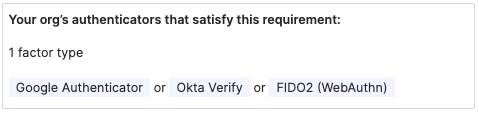
1. Now check **Phishing resistant** and you’ll notice that only Okta Verify and FIDO2 (WebAuthn) satisfy this requirement now.
1. Selecting **Hardware protected** will show only Okta Verify as supported. We are adding catalog support for specific WebAuthN authenticators that are hardware protected so these will satisfy this requirement in the future as well.
1. Notice that the default setting for AND If Okta FastPass is used is The user must approve a prompt in Okta Verify or provide biometrics
1. Scroll down to **Re-authentication frequency** and set AND Re-authentication frequency to Every sign-in attempt this will make testing the settings simpler. Save these settings.
1. Switch to your user browser and launch the *High* application from your dashboard. You will be prompted in Okta Verify and be logged into the application successfully.

## Okta Verify FastPass Silent Probing

In this section we will modify the policy to demonstrate silent probing

1. Switch back to your Administrator browser and edit the Policy Rule again. Change the setting for *AND If Okta FastPass is used* to *The user is not required to approve a prompt in Okta Verify or provide biometrics*.

1. Switch to the user browser and navigate to the Okta dashboard again. This time when you click on the *High* application you’ll notice that you’re logged in directly and Okta Verify does not pop up. This is a demonstration of silent probing with Okta Verify.

## Okta Verify FastPass Satisfy Multiple Factors

In this section we will modify the policy to demonstrate how Okta Verify can satisfy multiple factors.

1. Switch back to your Administrator browser and edit the Policy Rule again. Change the setting for *AND User must authenticate with* to **Any 2 factor type**.
1. Switch to the user browser and navigate to the Okta dashboard again. This time when you click on the *High* application you’ll be prompted in Okta Verify for Touch ID and you’ll be logged into the application. This shows Okta verify satisfying both Biometric and Phishing Resistant Possession factors.

## Managing Devices

In this section we will look at the Devices section of the directory.

1. In your Administrator Console navigate to **Directory -> Devices** you will see something similar to the below for the devices you have registered with Okta Verify.

1. Select one of the devices and you’ll see a list of users that have registered with Verify with that device, a list of security signals from that device and the device identifiers.
1. Note that there are buttons for **Suspend** and **Deactivate** buttons. Click **Suspend** for your laptop.
1. Switch to your user browser and attempt to login using Okta Verify. You will receive a denial like the below.

1. Switch back to your Administrator console and click **Unsuspend**.
1. Back in the user browser, refresh the dashboard and launch the app again. You will be successfully logged in.

---
# Passwordless Users

In this lab we will show how to add Passwordless users. For detailed information refer to the documentation.

## Enable Self Service Enrollment
1. Add a new group called Passwordless following the instructions in Lab 1. 
1. Switch to the **Applications** tab in the group and assign the High application to this group.
1. Navigate to **Security -> Profile Enrollment** and click the pencil next to the default policy. Then click **Edit** for the **Profile Enrollment** setting. Toggle the *Self-service registration* to *Allowed* and under *Add user to group* select the *Passwordless* group you just created. Scroll down and hit **save**.

1. Scroll down to the **Profile enrollment form** and click **Add form input**. 
1. From the list select *Secondary email (secondEmail)* and set the *Input Requirement* to optional. It should look like the below. Click **Save**.

## Add Passwordless Enrollment Policy
1. Navigate to **Security -> Authenticators** and switch to the **Enrollment** tab.
1. Create a new policy called *Passwordless* and assign it to the Passwordless group. Under the **Eligible authenticators**: set *Email* to *Required* and *Password* to *Disabled*.

## Configure Passwordless Authentication Policy
1. Navigate to **Security -> Authentication Policies** and click **Add a Policy**.
1. Name the policy *Passwordless* and modify the catch all policy to *Allowed with any 1 factor type*.
1. Switch to the applications tab and add the *Okta Dashboard* and *High* application to this policy.

## Sign-up
1. Switch to the user browser session and sign out if you’re currently logged in. You should now see an option to *Sign Up* at the bottom of the login dialogue.

1. When you click on this you’ll be presented with the below screen. Fill in these details with an email you have access to that you haven’t used for a user yet.

1. When you click sign up an email will be sent to the associated email address. Click the link or click *Enter a verification code* instead and enter the code from the email.

1. You’ll then be prompted to enroll in Okta Verify or a Security Key. Follow the prompts and complete this enrollment.
1. You’ll then be asked whether you would like to enroll in optional factors. You can simply click **Setup Later** and you should get access to the dashboard.
1. Log out and log back in with the user and you can experience the passwordless flow.

---
# Contextual Access & Device Management

If you have time please feel free to add network and behavior detection rules to your tenant.

## Networks & Zones
1. Navigate to **Security -> Networks**.
1. There are two default Zones already configured. *BlockedIpZone* and *LegacyIpZone*.
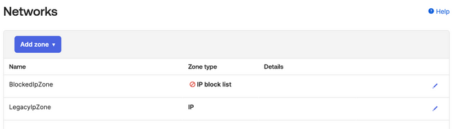
1. We are going to add a trusted IP Zone containing our computer address. To do this click **Add Zone -> IP** Zone as shown below.

1. Name the new zone Trusted Enterprise Network or similar and click on the address next to **Add your current IP address**. This will add your computer's address to a trusted list and we can later use this in Authentication Policies.
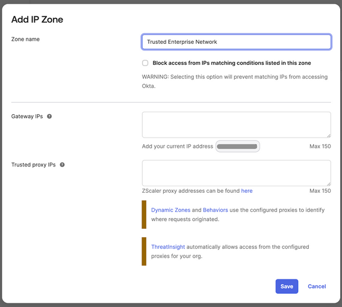
1. Next we can add a Dynamic Zone to block access from Tor proxies.  To do this click **Add Zone -> Dynamic Zone**. Check *Block access from IPs matching conditions listed in this zone* and from the **IP type** drop down select *Tor anonymizer proxy* as shown below.
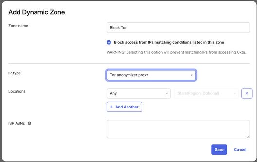
1. Your *Networks* list should now look similar to the following.

> ### Note
> * Adaptive SSO or Adaptive MFA licenses are required to  leverage Dynamic Zones
> * At a later stage if you would like to see what is added to Okta Logs when an IP is blocked you can add your computer IP to the BlockedIpZone by clicking on the pencil Icon at the end of the line and then clicking on your current IP address as shown below. Please ensure you remember to remove  this setting afterwards if you wish to test other policies in more detail.
> 

## Behavior Detection (Information only)
1.  Navigate to **Security -> Behaviour Detection**.

1. Here you can see and adjust a wide range of behaviors. These can be later used in authentication policies either leveraging the Risk level Okta assigns or specifically by evaluating specific behaviors in a custom expression. See the (Okta Expression language documentation)[https://developer.okta.com/docs/reference/okta-expression-language-in-identity-engine/] for more details.
> ### Note
> Location data is provided by a third-party geolocation service. Okta updates the geolocation IP data on a weekly basis.

## Device Integrations (Information only)

Device Integrations are used to link Okta with endpoint management systems such as InTune, JAMF etc. We will not be leveraging these device integrations during this workshop.
1. Navigate to **Security -> Device Integrations**. Here you will see three tabs.
1. The first and second tabs *Endpoint Management & Certificate Authority* allows you to add a device management platform, such as JAMF or Intune, and the associated trusted certificate chain. You can find more details on specific configuration in the (documentation)[https://help.okta.com/oie/en-us/Content/Topics/identity-engine/devices/managed-main.htm].
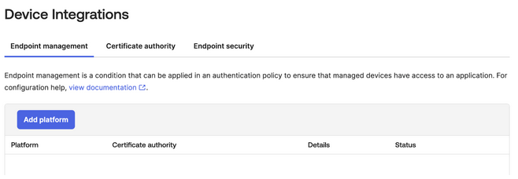
1. The third tab Endpoint Security allows you to integrate with CrowdStrike or Windows Security Center to leverage signals directly from the endpoints during authentication policy evaluation.
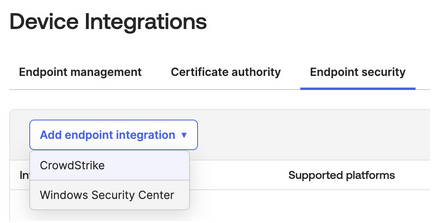

---
# Dectecting & Responding to Phishing Attacks
In this section, we will look at how you can enable Okta Fastpass to detect and respond to real-time phishing attacks caused by AiTM services like EvilGinX. **This guide will not cover setting up of EvilGinX.**

In the previous lab section, you’ve already learned how to enable Okta Fastpass as an Authenticator for your end-users.

The next section will focus and discuss on how you can leverage Fastpass to detect and respond to Phishing attacks targeted by threat actors to your end users.

One benefit of using Okta Fastpass is that by default it already inherits phishing resistant qualities meaning it is able to automatically detect if the site is a phishing site or legitimate site. If it is a phishing site, automatically, it will provide an end-user friendly message to your end users.

The only prerequisite to have this feature/capability enabled is to make sure your end-users are running the latest version of Okta Fastpass and have their Okta account enrolled with it.
From an administrator level, the only task you need to do is to create a rule within your Authentication Policy that leverages Fastpass as the authenticator of choice. Always remember that phishing sites will always try to farm your end-user’s password by imitating your identity provider’s authentication/login page/screen/service. The goal is to not allow your end-users to not use a password or non-phishing resistant authenticators as part of the authentication process such that nothing is shared or stored to your attacker’s service.

# Create an Phishing proof Authentication Policy rule

1. Navigate to any one of your Authentication policies and create a new rule.

1. If we inspect the rule closely, this is what should be defined from a policy decision point perspective:

1. From a policy enforcement point perspective, this is what should be defined:
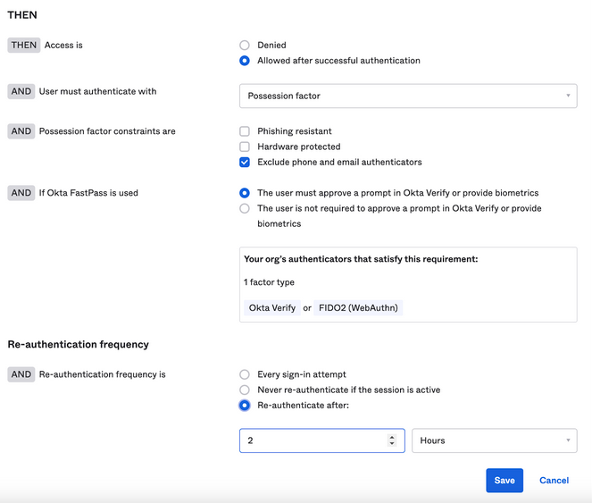
1. Click **Save** and make sure the rule is ranked as one of the highest ranking of your authentication policy.

You will be able to try this out in a different Okta environment that will be supplied during the actual workshop/event as this requires an EvilGinX instance mirroring your Okta instance. 

# Adding Observability and Workflows (Information only)
Okta logs every transaction and processed event within the platform. All of these logs are kept and accessible via Okta’s System Log. Okta also provides extensibility points within the platform through Hooks. One type of hook that we can leverage here is (Event Hooks[https://help.okta.com/oie/en-us/Content/Topics/automation-hooks/event-hooks-main.htm?cshid=ext-event-hooks]. 
You can define multiple Event Hooks within the Okta platform. Navigate to **Workflow -> Event Hooks**.

You can do the following instructions at your own time or pace. You can create Event Hooks that will meet your requirements and specifications. The example Event Hooks workflow we will define below will intercept and Phishing Attacks declined by Okta Fastpass. 

1. Click Create Event Hook 
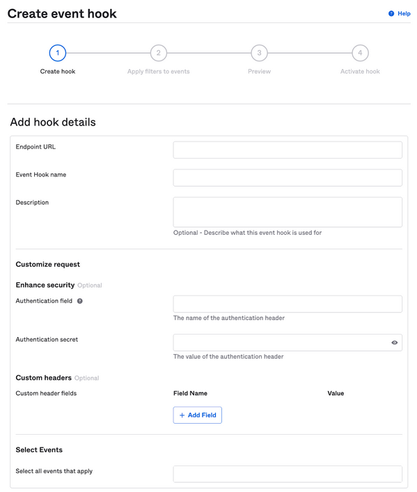
2. Supply an Endpoint URL, Event Hook Name and description. 
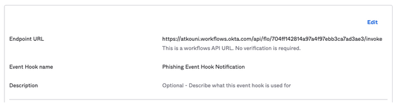
3. Let’s leave the Customise Request as default.
4. Let’s select a specific event.

5. Click Next and let’s apply a filter.

6. Click the Use Okta Expression Language (advanced)
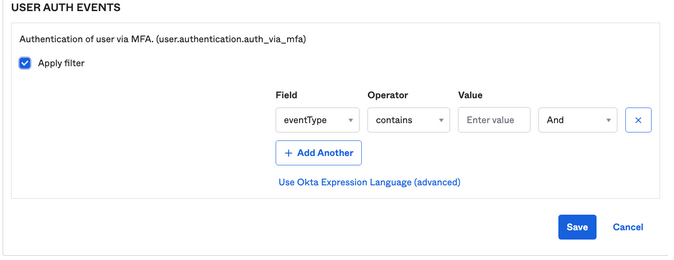
7. Use the following filter `event.outcome.reason eq "FastPass declined phishing attempt"`. Click **Save**.

8. Make sure you also verify the Event hook you created by following the instructions here.